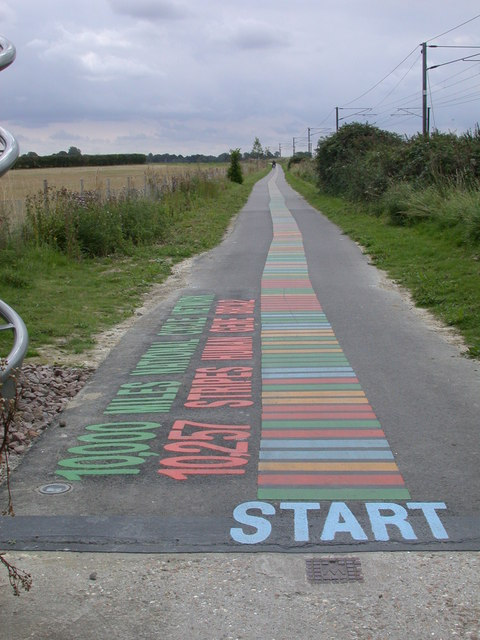

<!---
Content linked to by History of the BRCA Exchange under About
-->

# History of the BRCA Exchange  

Genetic sequencing labs, academic centers, and companies all work independently to classify BRCA1/2 variants as pathogenic or benign using clinical data and other evidence. Unfortunately, each of these individual laboratories are limited in their efforts because they do not have access to data that has been aggregated across all these groups.  While some groups have begun adding their data into shared databases, there has not been full exchange of all BRCA1/2 data among laboratories.  

In March 2014, Professor Sir John Burn of Newcastle University, UK proposed a data sharing experiment now called the BRCA Challenge at the first plenary meeting of the [Global Alliance for Genomics and Health](http://genomicsandhealth.org/) (GA4GH), to address these issues. Over the subsequent months, John Burn and co-chair Stephen Chanock of the National Cancer Institute, USA, formed a Steering Committee including leaders from the breast cancer field and from genomic data sharing efforts. The Steering Committee defined initial goals for the Challenge including:

1. Share BRCA1 and BRCA2 variants publically

2. Create an environment for collaborative variant curation with access to evidence (e.g. phenotypes, family history, genetic data, and functional studies)

3. Create a curated list of BRCA variants, interpreted by expert consensus, to enable, without dictating, accurate clinical care

4. Address the social, ethical, and legal challenges to global data sharing, and engage with patient advocacy organizations from around the world

In collaboration with the Human Variome Project, on June 12-13, 2015, a meeting to further develop the vision for data sharing and expert BRCA variant classification took place at UNESCO headquarters in Paris, including representatives from many laboratories and organizations including Ambry Genetics, AstraZeneca, Annai Systems, ClinGen, ClinVar, Curoverse, DECIPHER, DNAnexus, ENIGMA, Genetic Alliance, Genomics England, Illumina, Inserm, Invitae, LabCorp, LOVD, New England Journal of Medicine, Quest, SolveBio, World Health Organization and many others.

At this meeting, the vision of a web portal to share expert-reviewed BRCA variant classifications was proposed. Since this time, working groups with members located around the world have worked to identify 1) sources of classified variants to be aggregated and 2) unclassified variants with evidence, which can then be interpreted, classified, and aggregated. The classified variants are then displayed at a public portal, the BRCA Exchange, for use by clinicians, patients, and labs to enable accurate understanding of any individual BRCA1/2 variant.

The BRCA Exchange represents the combined vision of clinicians, researchers and patient advocates from institutions around the world.  The individuals listed below participate in the leadership of this effort.

* John Burn, Newcastle University, Newcastle upon Tyne, UK

* Stephen Chanock, National Cancer Institute, Rockville, USA

* Antonis Antoniou, University of Cambridge, Cambridge, UK

* Larry Brody, National Human Genome Research Institute, Bethesda, USA

* Robert Cook-Deegan, Duke University, Durham, USA

* Fergus Couch, Mayo Clinic, Rochester, USA

* Johan den Dunnen, Leiden University Medical Center, Leiden, Netherlands

* Susan Domchek, University of Pennsylvania, Philadelphia, USA

* Douglas Easton, University of Cambridge, Cambridge, UK

* William Foulkes, McGill University, Montreal, Canada

* Judy Garber, Dana-Farber Cancer Institute, Boston, USA

* David Goldgar, Huntsman Cancer Institute, Salt Lake City, USA

* Kazuto Kato, Osaka University, Osaka, Japan

* Delyth Jane Morgan, Baroness Morgan of Drefelin, Breast Cancer Now, Cancer Research UK
 
* Robert Nussbaum, University of California San Francisco, San Francisco, USA

* Kenneth Offit, Memorial Sloan Kettering Cancer Center, New York, USA

* Sharon Plon, Baylor College of Medicine, Houston, USA

* Gunnar Raetsch, Memorial Sloan Kettering Cancer Center, New York City, USA

* Nazneen Rahman, Institute of Cancer Research, London, UK

* Heidi Rehm, Harvard Medical School, Boston, USA

* Mark Robson, Memorial Sloan Kettering Cancer Center, New York City, USA

* Wendy Rubinstein, National Institute of Health, Bethesda, USA

* Amanda Spurdle, QIMR Berghofer Medical Research Institute, Herston, Australia

* Dominique Stoppa-Lyonnet, Curie Institute, Paris, France

* Sean Tavtigian, Hunstman Cancer Institute, Salt Lake City, USA

* David Haussler, UC Santa Cruz Genomics Institute, Santa Cruz, USA

* Bartha Knoppers, McGill University, Montreal, Canada

The BRCA genes loom large in public awareness.  This photo shows a bicycle path in Shelford, England that depicts the sequence of the BRCA2 gene.  The lanes of the path are separated by colored stripes.  Each stripe represents one base of BRCA2, with the stripes color-coded according to the nucleotide. See also [http://www.bshs.org.uk/travel-guide/dna-cycle-path-cambridge-england](http://www.bshs.org.uk/travel-guide/dna-cycle-path-cambridge-england)
<!---
Picture: SC members at UNESCO in Paris (I think John Burn has this)
-->
