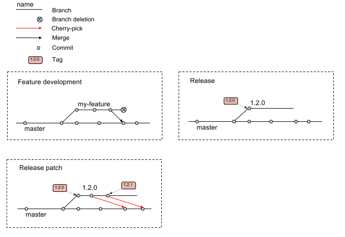

# Branching Overview

Features are developed on feature branches. Feature branches can be pushed to
github for CI testing. After they are merged to ```master```, they can be deleted on the
'branches' page at github.

When a feature is complete, the feature branch can be merged to ```master```. Commits
on ```master``` will be tested and deployed to brcaexchange-dev.gi.ucsc.edu.

When ```master``` is feature complete and ready for release, the ```release```
script is run to create a new release branch. The new release will be tagged,
tested, and deployed to brcaexchange-prod.gi.ucsc.edu for final QA testing.

If no bugs are found in QA, the ```deploy-production``` script is run
to copy brcaexchange-prod.gi.ucsc.edu to brcaexchange.org.

If bugs are found in QA, a fix is committed to the release branch, and
the ```release``` script is run to create a patch release. The new release
will be tagged, tested, and deployed to brcaexchange-prod.gi.ucsc.edu. The fix
is also cherry-picked or ported to ```master```.




# How do I...

## Work on a feature

```sh
git checkout -b myfeature   # create a feature branch
# commit feature code
git push origin myfeature   # push to github to run CI tests, if desired
git checkout master         # merge to master
git merge myfeature
git push origin master      # push master to github
```

## Create a new labeled release

Before running, make sure you're on master and pull the latest master from origin. Also make sure your working directory is clean, and that you're on a server where your git credentials allow pushing to master.  Also, this is best executed under a tmux or screen shell, particularly if there are any new database migrations to apply.

```sh
git pull origin master
cd website
npm install                 # update the release number in package.json and package_lock.json
cd ..
./deployment/release new    # create release branch & push to github
```
This will trigger the automated deployment of new code to beta in CircleCI, including applying any new database migrations.

## Patch a release

```sh
git checkout 1.2.0                 # check out the release branch
# commit bug fixes
git push origin 1.2.0              # push to github to run CI tests, if desired
./deployment/release patch 1.2.0   # tag release & push to github
git checkout master                # cherry-pick fixes to master
git cherry-pick abc123
...
```

## Deploy a release

This is best executed under a tmux or screen shell, especially if there are any database migrations to apply.  These steps are best executed under the _brca_ account on dev.

```sh
./deployment/deploy-production
```
This will copy the web portal software from beta to production, and will trigger any database migrations on the production database.

## Deploy new data to dev, beta or production

Deploying new data is a separate process from deploying new code.  The two deployments are deliberately de-coupled so that new code and new data can be deployed independently.  

```sh
./deployment/deploy-data <machine> PATH/TO/release-MM-DD-YY.tar.gz
```
Where _machine_ is one of _dev_, _beta_ or _production_
