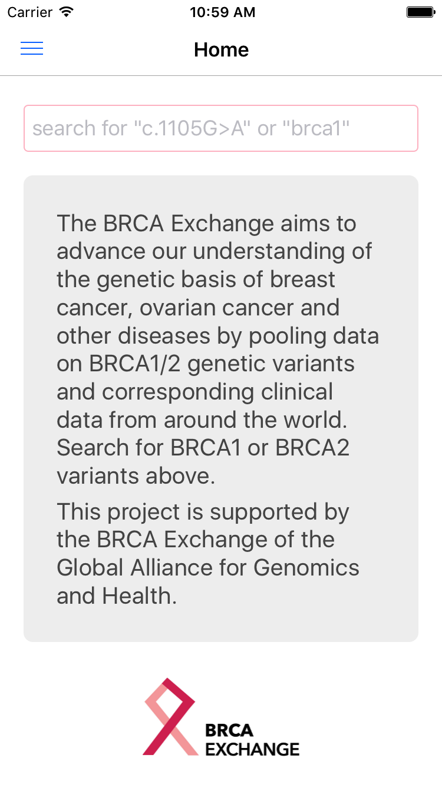
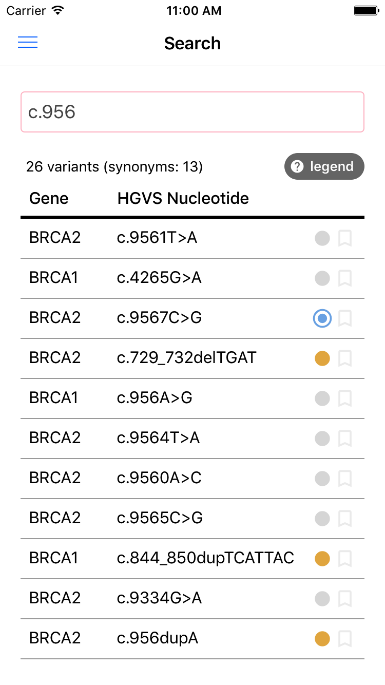
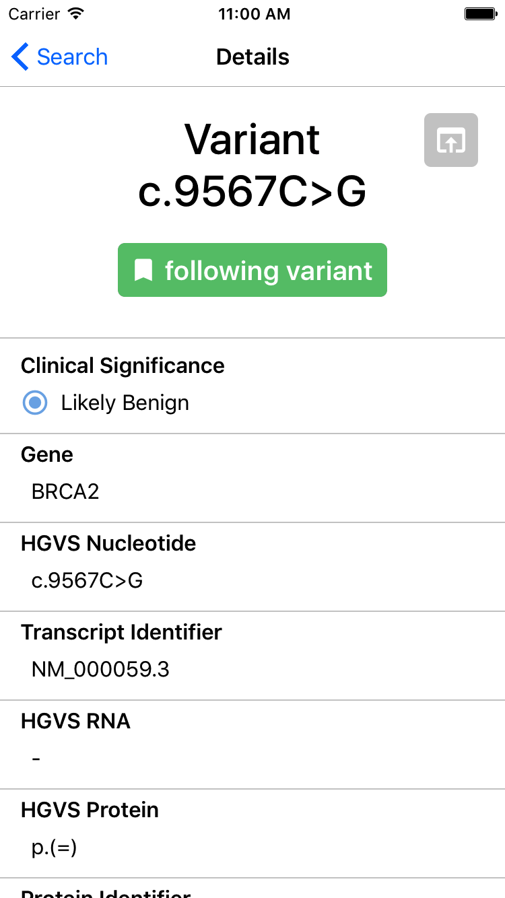

# BRCA Exchange Mobile App

The BRCA Exchange is the largest public source of BRCA1 and BRCA2 variant information available. The mobile app provides a simplified interface to search the BRCA Exchange for BRCA1/2 variant information and expert classifications of pathogenicity in real time. In addition to providing access to the variant information displayed in the web portal, users can follow variants of interest and receive notifications when their status is updated.

    

        </img>
        
Home Screen

    

    

        
        
Search Screen

    

    

        
        
Variant Details

    

The BRCA Exchange mobile app provides information on catalogued BRCA1 and BRCA2 genetic variants, including variant classifications that have been curated by an international expert panel, the ENIGMA consortium, to assess their pathogenicity (associated disease risk).  Variants listed as ‘not yet reviewed’ will be classified by the ENIGMA consortium soon.

The app is free of charge, and is available for Android™ and Apple iPhone/iPad® devices. Links to the Google Play and Apple App Store, respectively, are below.

    
    

<h3>Credits</h3>

The BRCA Exchange website is a product of the BRCA Challenge of the Global Alliance for Genomics and Health. The website and underlying database were developed by Molly Zhang, Charles Markello, Mary Goldman, Brian Craft, Zack Fischmann, Joe Thomas, David Haussler, Melissa Cline and Benedict Paten at the Computational Genomics Lab at the UC Santa Cruz Genomics Institute, Faisal Alquaddoomi, Marc Zimmerman and Gunnar Rätsch at Eidgenössische Technische Hochschule Zürich, and Rachel Liao at the Broad Institute and the Global Alliance for Genomics and Health, with input and feedback from many members of the BRCA Challenge working groups.

Variant data displayed in this app are made available using the standards-based GA4GH Genomics API.

---

Google Play and the Google Play logo are trademarks of Google LLC.

