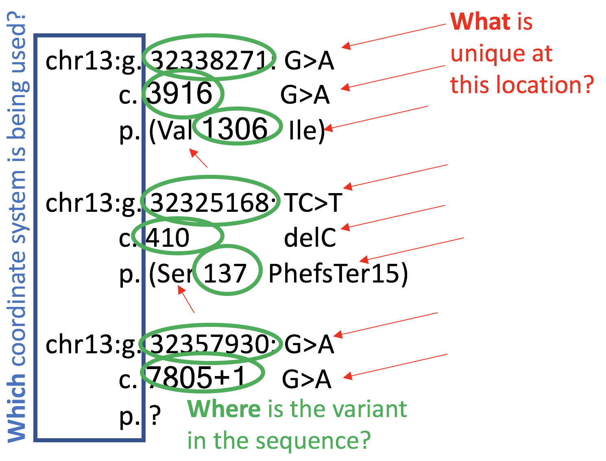

Genetic tests use a specific naming system to indicate which variation a patient has. These results appear as strings of letters and numbers that are listed as a variant. Some examples include:

* BRCA1 or BRCA2 (Gene Symbol)
* BRCA1 c.1105G\>A (Gene + HGVS Nucleotide)
* c.1105G\>A (HGVS Nucleotide)
* chr17:g.4305831 (Genomic Nomenclature)
* p.(Pro1238Leu) (HGVS Protein)

A variant may sometimes be called a mutation, in particular if there is evidence to indicate that it is pathogenic or likely pathogenic. Variant is a more general term, and will be used in this guide. Variant names, particularly those in HGVS format, adhere to consistent and systematic patterns. These patterns utilize numbers, letters, and abbreviations to indicate 3 basic things:
 
1. _Which_ coordinate system is being used?
2. _Where_ does a variant occur within the gene?
3. _What_ is unique at this location?

<figure style="width: 80%; margin: 0 auto 1em auto;">
    
</figure>

Every variant has multiple names, depending on the type of name. As an analogy, consider that UC Santa Cruz is located at 1156 High St. Santa Cruz, CA. The GPS coordinate for this address are 40.741895N,-73.989308W. Much like the same place can be named with both an address and a GPS coordinate, one variant can actually have multiple names. Names differ because of the various coordinate systems that are used for variant naming. 

For more information on variant naming, please visit our more extensive resotrce on [*Further Demystifying Variant Naming*](/about/moreOnNaming)
