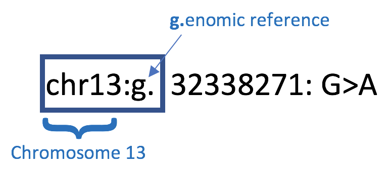
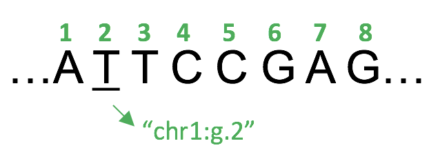
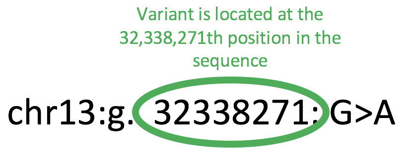
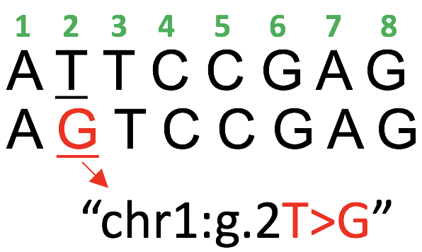
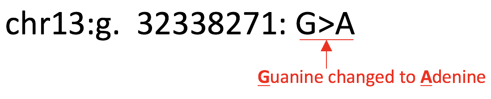
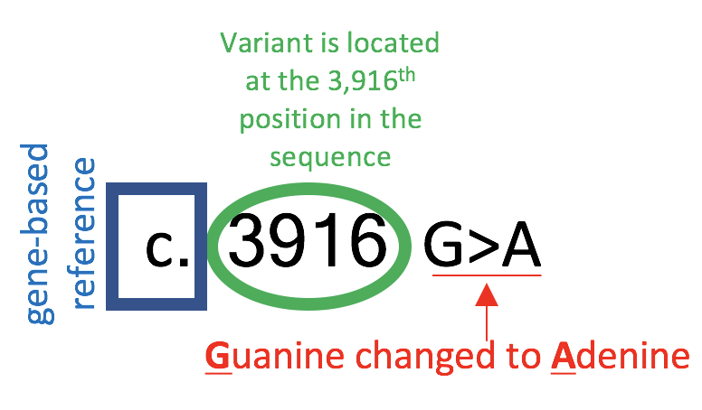
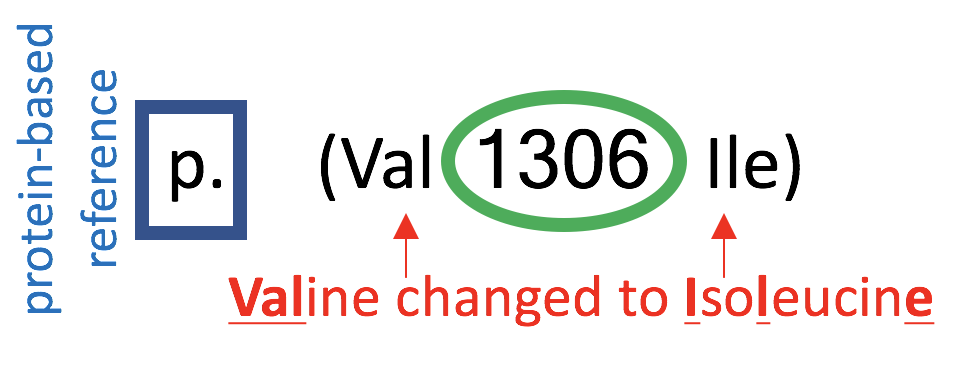
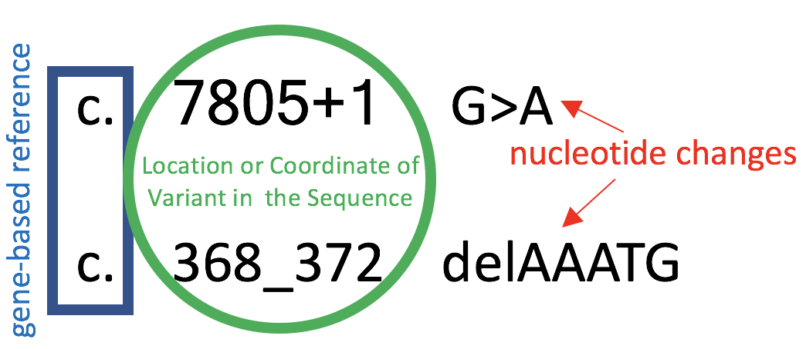

## Further Demystifying Variant Naming

The simplest variants, with the easiest names to decode, are the **substitution variants**. These are also known as **point mutations** or **single nucleotide variants (SNVs)**. Substitution variants contain a single base pair change in a DNA sequence. 

When a gene contains a substitution variant, there might be a ‘misspelling’ in its instructions that only includes one letter being replaced with another. A substitution variant’s name tells us _which_ sequence reference (genome-based, gene-based, or protein-based) is being used to describe the substitution variant, _where_ the variant is in the sequence, and _what_ single nucleotide change occurred at that location. 

This instructional aid will focus on the BRCA2 gene, and the variant 'chr13:g.32338271:G>A'. Chromosome 13, where the BRCA2 gene is found, is made up of about 115 million base pairs [Genetics Home Reference](https://ghr.nlm.nih.gov/chromosome/13)). 

So, the first question to ask when looking at a variant is “_Which_ coordinate system is being used?” The answer lies in the first few letters. In this case, the variant is referencing chromosomal DNA (the g.enome): 

<figure style="width: 50%; margin: 0 auto 1em auto;">
    
</figure>

The genome-based reference is like having a GPS mapping of a whole state: just like a map of California includes all of its cities, the genome-based reference includes all of a chromosome’s genes and nucleotides. In order to map Chromosome 13’s nucleotides, each one is numbered 1-115,000,000. There is a standard sequence of nucleotides that act as a reference, so that we may map variation against this standard sequence.

Numbering the standard sequence of nucleotides keeps track of _where_ the variant is. To use a simple example, let us pretend that Chromosome 1 is only 8 nucleotides long, and that its standard sequence is provided below. We can refer to the first T in the sequence using variant nomenclature, noting that the first T is at position 2, perhaps using a name like “chr1:g.2”.

<figure style="width: 50%; margin: 0 auto 1em auto;">
    
</figure>

To decode the real example of 'chr13:g.32338271:G>A’, the number can be used to answer “_Where_ does the variant occur in the sequence?”. In this case, the variant has a change at the 32,338,271th position on chromosome 13, as given by its genomic number or 'coordinate':

<figure style="width: 50%; margin: 0 auto 1em auto;">
    
</figure>

The final question to answer about this variant is "_What_ is unique about this variant?" The simple example of the 8 base-pair long chromosome can help introduce how to understand this question. If there is a standard sequence that can be used for reference, a slightly different sequence can be aligned below it. Then, any changes that make the variant unique can be listed according to _what_ is different in the new sequence compared to the standard one. 

<figure style="width: 30%; margin: 0 auto 1em auto;">
    
</figure>

In the case of the actual variant below, the G>A indicates that while the standard sequence (also called the [reference genome](https://en.wikipedia.org/wiki/Reference_genome)) has a ‘G’ at position 32,338,271, the variant’s nucleotide has been changed to an ‘A’ at that position. In other words, in this genomic sequence, the G at this position has been substituted with an A. 

<figure style="width: 60%; margin: 0 auto 1em auto;">
    
</figure>

So far the name ‘chr13:g.32338271:G>A’ describes _which_ coordinate system is being used, _where_ the DNA differs from the standard sequence (also called the [reference genome](https://en.wikipedia.org/wiki/Reference_genome)), and what is different about the DNA. But what about the other coordinate systems, beside the genome based system, that are used? 

Although having a genome-based reference system is helpful, sometimes scientists only want to focus on a single gene. This is particularly true for genetic testing, where one or more specific genes are targeted because they relate to the condition of interest. This is where a gene-based reference is useful, which is indicated by a “c.” at the beginning of the variant name. Rather than numbering all 115,000,000 nucleotides on chromosome 13, the c. system can ‘zoom-in’ on only the 84,000 nucleotides that make up BRCA2. The gene-based, or “c.”, reference can be thought of as a map of one city, instead of a whole state. Because genes code for proteins, this is considered the coding DNA (cDNA) reference.  

Just like someone can live in the same neighborhood on both a state’s map and a city’s map, the same variant can be referenced using all of chromosome 13, or only the BRCA2 gene. The “c.” gene-based reference implements the name “c.3916G>A” for the variant that has been discussed so far. 

The c. indicates that the variant is referenced per the 84,000 nucleotides within the BRCA2 gene, the 3916 indicates the position within the gene, and the “G>A” indicates the nucleotide change, telling us that a G was substituted with an A. Again, this is the same variant using a different reference: the gene. 

<figure style="width: 50%; margin: 0 auto 1em auto;">
    
</figure>

A final reference available uses a “p.”, which indicates a protein-based variant name. The “p.” version of the variant above is “p.(Val1306Ile)”.  To answer “What changed in this variant?” the p. nomenclature references [amino acids](https://en.wikipedia.org/wiki/Amino_acid) that changed as a result of the variant, rather than nucleotides. The protein-based reference doesn’t refer to nucleotides because the cell has already processed the gene instructions to make a chain of amino acids. Because genes code for proteins, a change in the gene often results in a change in the protein. The p. nomenclature demonstrates this protein change.

<figure style="width: 50%; margin: 0 auto 1em auto;">
    
</figure>

Sometimes, a protein will remain unchanged, even if there is a variant in its gene instructions. In other cases, the variant can cause a significant change in proteins that increase risk of cancers or other disease. 

Substitution variants are perhaps the easiest names to understand, but as the variant gets more complicated, the names can get more intimidating. Even if it becomes difficult to understand the specifics, it is still possible to get a general idea of what any variant name means. 

If a variant name looks very complex because there are symbols or other unfamiliar abbreviations, recalling the three questions can still give a general idea of the variant name:

* Which coordinate system is being used?
* Where does the variant occur in the sequence?
* What is unique about this variant? 

<figure style="width: 50%; margin: 0 auto 1em auto;">
    
</figure>

The above content was generated using information from the Human Genome Variation Society's resources on [Sequence Variant Nomenclature](http://varnomen.hgvs.org/).
For more information from a patient perspective, please visit [BRCA Mutations Made Simple](https://bravebosom.org/2013/08/28/brca-mutations-made-simple/).
