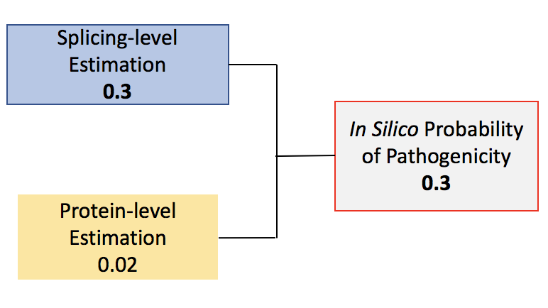

The *In Silico* Prior Probability of Pathogenicity can be used to predict whether a variant will have a pathogenic effect or not. Calculations can be applied for almost every variant based on type or location, regardless of how rare the variant is or what variant-level clinical data is available.  Though each calculation does not require clinical data, the assigned probabilities are based on bioinformatic categories that were thoroughly developed and calibrated using clinical data sets of known pathogenic and non-pathogenic variants (3). **Please note these are [in silico](https://en.wikipedia.org/wiki/In_silico) predictions, and cannot be used to classify a variant without additional clinical and functional analysis data for the variant. For classification guidelines, please refer to the [American College of Medical Genetics and Genomics Guidelines](https://www.acmg.net/docs/Standards_Guidelines_for_the_Interpretation_of_Sequence_Variants.pdf).** If available for the variant, clinical data can be found in the ENIGMA, ClinVar, or Multifactorial Likelihood Analysis tiles on the Variant Details Page. 

The predicted pathogenicity for a given variant can be associated with impact on protein translation, protein function, or interference with mRNA splicing. The *In Silico* Prior Probability of Pathogenicity accounts for all three mechanisms, and uses the type and the location of the variant to make predictions. The higher of two estimations, the Protein-level Estimation or the Splicing-level Estimation, is ultimately assigned as the *In Silico* Prior Probability of Pathogenicity. By choosing the higher estimation, our model ensures that pathogenicity is predicted according to highest possible variant impact.

<figure style="width: 80%; margin: 0 auto 1em auto;">
    
    <figcaption>In this example, the Splicing-level estimation is 0.3, which is greater than the Protein-level estimation 0.02. Thus, the *In Silico* Prior Probability of Pathogenicity is assigned as 0.3 due to predicted splicing-level impact. In other words, splicing impact is predicted to introduce the most probability of pathogenicity for this variant in this case. In other cases, both estimations may independently predict pathogenicity, but the highest is still chosen as the overall prior probability.</figcaption>
</figure>

In the tile, an In Silico Prior Probability of Pathogenicity is displayed on a scale of 0.00 to 1.00. An arrow and a line indicates the prior probability, with red indicating a higher prior probability of impact and blue a lower. It also displays variant location, variant type, and a link to the [HCI Breast Cancer Genes Prior probabilities website](http://priors.hci.utah.edu/PRIORS/), which provides more information about these probabilities. 

To display more detail about the prediction, nested tiles can be expanded by clicking on their headers. For Protein-level and Splicing-level Estimation tiles, prior probabilities are assigned in order to estimate a variant’s predicted impact on both protein translation and mRNA splicing respectively. 

The Protein-level Estimation checks whether the variant is in a Clinically Important Functional Domain (CI Domain, as designated by ENIGMA) and the predicted severity of the variant using Align-GVGD scores. Align-GVGD scores assess the difference in physicochemical properties for the amino acid change versus the observed range of variation in these properties across species at that position in the protein (2,3).

A splicing-level estimation is also calculated. A variant can impact splicing in two ways: either it alters an existing (wild-type) splice donor or splice acceptor site, or it creates a new (de novo) splice site that is used instead of the wild-type site. The splicing-level estimation calculates prior probabilities for a variant to alter wild-type donors/acceptors, or create de novo donors.Prior probabilities for each type of splice site are displayed across the three tabs in the nested tile. Because these probabilities are often mutually exclusive, it is common for at least one value to be Not Applicable (N/A).

In general, green, yellow, and red indicate low, moderate, and high prior probability of pathogenicity respectively. However, there are some specific color schemes used in each splicing-level tab. For variants in wild-type donor and acceptor regions, a blue row labeled “Improved” indicates that the wild-type splice site score was improved by the variant. A gray row labeled “Outside consensus region” indicates that the variant is not in a splice site. Both of these colors have low prior probabilities associated with them. In the De Novo Donor tab, however, increased splice likelihood actually heightens probability of pathogenicity; increased likelihood of de novo splicing increases the likelihood for altered splicing. Thus, in the case of De Novo Donors, a red row labeled “Increased” is used to indicate that the variant increases prior probability of pathogenicity. 

For more information about these probabilities, please visit our resource detailing [Scoring Systems for *In Silico* Probabilities of Pathogenicity](/about/insilicoScoring).

##### References
1. Vallée, MP. 2016. [PMID 26913838](https://www.ncbi.nlm.nih.gov/pubmed/26913838).
2. Tavtigian, SV. 2006. [PMID 16014699](https://www.ncbi.nlm.nih.gov/pubmed/16014699)
3. Tavtigian, SV. 2008. [PMID 18951461](https://www.ncbi.nlm.nih.gov/pubmed/18951461)
